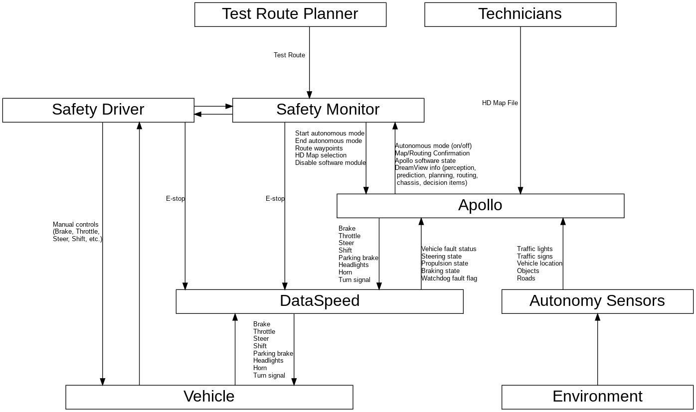

# STPA for Autonomous Vehicles

**All work here is Work In Progress, and is published on an "AS IS" BASIS,
WITHOUT WARRANTIES OR CONDITIONS OF ANY KIND, either express or implied.**

## Project Overview

The aim of this project is to develop a base set of safety requirements which will be widely applicable to many autonomous vehicles.

This project is part of [Trustable](https://gitlab.com/trustable/documents/wikis/home).

## A Systems Approach to Safety

Software systems are becoming increasingly complicated, they are often in the order of millions of lines of code running on complex hardware platforms, and current safety standard techniques which focus on failure rates of individual components are ineffective. It is unachievable to test large software for every set of possible states. As well as this, regardless of failure rates, accidents can be caused by poor system design, where each component is acting exactly as designed. This project has found circumstances where even if nothing fails, and everything is acting entirely reasonably and as intended (hardware, software and humans), severe accidents are still possible due to the way these things interact with each other. It is clear that safety techniques are needed to improve the design process, so that complex systems can be analysed properly. System-Theoretic Process Analysis (STPA) is a systems approach to safety, developed at MIT. It allows us to look at the system as a whole, and abstract complexity by starting at a very high level using black boxes. We can then zoom into these black boxes and iterate the process through more and more detailed levels. Through STPA it is possible to develop a set of safety requirements which will determine the software architecture requirements.

## STPA

> STPA (System-Theoretic Process Analysis) is a relatively new hazard analysis technique based on an extended model of accident causation. In addition to component failures, STPA assumes that accidents can also be caused by unsafe interactions of system components, none of which may have failed.

The above is from the STPA handbook, which can be found [here](http://psas.scripts.mit.edu/home/materials/).

This repo contains a Work In Progress (WIP) STPA for an autonomous vehicle containing Apollo 2.0. Even though this is looking at a specific implementation of an autonomous vehicle, it is believed that the work done will be widely transferable.

## Apollo

[Apollo](http://apollo.auto/) is an Open Source Autonomous Vehicle project ([repo](https://github.com/ApolloAuto/apollo)), which provides a software platform for its partners to develop their own autonomous driving systems. It is made available by Baidu under the Apache 2.0 License. The purpose of this project is to analyse the safety of a specific implementation of Apollo v2.0, as is shown below.

## The Repo

This repo contains analysis of the Apollo 2.0 code which was conducted to answer specific questions which would help with the STPA analysis, as well as the STPA analysis itself.
