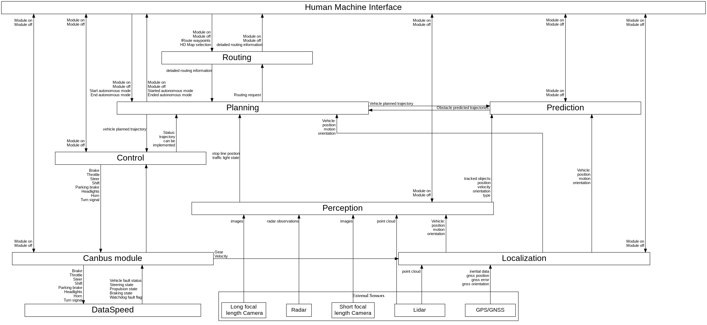

# STPA Results

The STPA analysis has been done over 3 levels so far. Level 1 is looking at safety from a high abstraction, and each level becomes more focussed on details.

## Level 1

Level 1 considers building a team to design an autonomous vehicle from a safety point of view.

## Level 2

Level 2 analyses the vehicle safety with Apollo as a "black box", considering its interactions with the vehicle.

## Level 3

Level 3 zooms into the Apollo software, and analysis the interactions between software modules within.

## STPA Method

The [STPA Handbook](http://psas.scripts.mit.edu/home/materials/) explains the process of how to do STPA. It should not be essential to know the process thoroughly to follow an analysis. For those unfamiliar with the process, there are four steps (key terms are highlighted in **bold**):

1. Define the purpose of the analysis
  - What kinds of **losses** will the analysis aim to prevent, and what are the **hazards** (system states) that can cause these losses. This can be loss of life, damage to property or even company reputation
2. Model the control structure
  - A strictly hierarchical system model that is composes of feedback control loops. Downwards arrows are stricly **control actions** while upward arrows are **feedback**
3. Identify **Unsafe Control Actions (UCAs)**
  - Unsafe control actions are control actions that are either not provided when they should be, provided when they shouldn't, provided too early / too late or applied too long / too short. Given certain **contexts**, these occurrences can lead to losses.
4. Identify loss **scenarios**
  - Analyse the scenarios in which an unsafe control action can happen and lead to a loss.
