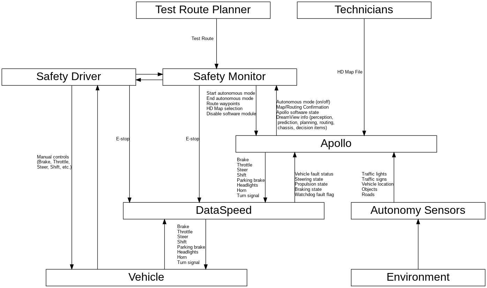

# Control Diagram

# Unsafe Control Actions (UCAs)

## Apollo

<table>
  <tr>
    <th>Control Action</th>
    <th>Not Providing</th>
    <th>Providing</th>
    <th>Too Early / Too Late / Out of Order</th>
    <th>Stopped Too Soon / Applied Too Long</th>
  </tr>

  <tr>
    <td>Brake Control  (brake control action with a significant level of braking: >x%)</td>
    <td class="Not Providing">
      UCA-6.1: Apollo does not provide brake control when relative velocity and distance to an obstacle mean that a collision is imminent [H-2, H-3, H-4]  
      UCA-6.2: Apollo does not provide brake control when in autonomous mode and vehicle speed exceeds limits (limits for controllability, stability, upcoming manoeuvre, speed limit, traffic flow limit, planned test limit, etc.) [H-1, H-2, H-3, H-4, H-6]  
      UCA-6.3: Apollo does not provide brake control when in autonomous mode, the vehicle is stationary, and vehicle path is not clear [H-2, H-3, H-4]  
      UCA-6.4: Apollo does not provide brake control when in autonomous mode and the vehicle has reached the final destination [H-7]  
      UCA-6.6: Apollo does not provide brake control when in autonomous mode and collision occurs [H-1, H-2, H-3, H-4, H-5]
    </td>
    <td class="Providing">
      UCA-6.7: Apollo provides brake command with insufficient amount of braking below the minimum amount needed to avert a forward collision [H-2, H-3, H-4]  
      UCA-6.8: Apollo provides brake control when autonomous driving is not active (off, standby, overridden, or e-stop) [H-3, H-4, H-5, H-6]  
      UCA-6.9: Apollo provides brake control when vehicle speed does not exceed limits (speed limit, traffic flow limit, manoeuvre limit, planned test limit, etc.), there is no obstacle, no faults, destination is reachable, and vehicle has not reached destination [H-4]  
      UCA-6.10: Apollo provides brake control when driver is providing throttle [H-4, H-5, H-6]  
      UCA-6.11: Apollo provides excessive brake command when wheel lock has occurred and lateral control is needed  (rationale: ABS may not work below 5mph or other situations) [H-1, H-2, H-4, H-6]  
      UCA-6.12: Apollo provides brake command with insufficient amount of braking to reduce vehicle speed within limits (limits for controllability, stability, upcoming manoeuvre, speed limit, traffic flow limit, planned test limit, etc.) [H-1, H-2, H-3, H-4, H-6]  
      UCA-6.13: Apollo provides brake control that is excessive beyond physical limits for passengers
    </td>
    <td class="Too Early / Too Late / Out of Order">
      UCA-6.14: Apollo provides brake control too late (> TBD seconds) after relative velocity and distance to an obstacle mean that a collision is imminent [H-2, H-3, H-4]  
      UCA-6.15: Apollo provides brake control too late (> TBD seconds) prior to manoeuvre [H-1, H-2, H-3, H-4, H-6]  
      UCA-6.16: Apollo provides brake control too late before (< TBD sec before) limits are exceeded (limits for upcoming manoeuvre, controllability, stability, speed limit, traffic flow limit, planned test limit, etc.) [H-2, H-3, H-4, H-6]
    </td>
    <td class="Stopped Too Soon / Applied Too Long">
      UCA-6.17: Apollo removes brake control too early when relative velocity and distance to an obstacle mean that a collision will occur [H-2, H-3, H-4]  
      UCA-6.18: Apollo removes brake control too early (> TBD seconds) prior to/during manoeuvre [H-1, H-2, H-3, H-4, H-6]  
      UCA-6.19: Apollo stops applying brake control when in autonomous mode before (> TBD seconds before) vehicle slows to acceptable speed (speed limit, traffic flow limit, manoeuvre limit, planned test limit, limits for controllability, stability, etc.) [H-1, H-2, H-3, H-4, H-6]  
      UCA-6.20: Apollo continues applying brake control too long (> TBD seconds) after vehicle slows to acceptable speed (speed limit, traffic flow limit, manoeuvre limit, planned test limit, limits for controllability, stability, etc.) [H-3, H-4]  
      UCA-6.21: Apollo stops applying brake control too soon at end of test before driver has resumed control (e.g. manual braking) [H-1, H-2, H-3, H-4]  
      UCA-6.22: Apollo stops applying brake control when collision occurs and driver has not resumed control (e.g. manual braking) [H-1, H-2, H-3, H-4, H-5]
    </td>
  </tr>

  <tr>
    <td>Repetitive Brake Command</td>
    <td class="Not Providing">
      UCA-7.1: Apollo does not provide any brake command (0-100%) when in autonomous mode (assumption: brake commands always sent on regular interval even if 0% brake is commanded) [H-1, H-2, H-3, H-4, H-6]
    </td>
    <td class="Providing">
      N/A
    </td>
    <td class="Too Early / Too Late / Out of Order">
      UCA-7.2: Apollo provides a brake command with too early timing that is outside of the time range when the signal is expected at the recipient (msg rate too high) [H-5]  
      UCA-7.3: Apollo provides a brake command with too late timing that is outside of the time range specified for when the signal is supposed to arrive at the recipient (msg rate too low) [H-5]
    </td>
    <td class="Stopped Too Soon / Applied Too Long">
      N/A
    </td>
  </tr>

  <tr>
    <td>Steering</td>
    <td class="Not Providing">
      Apollo does not provide steer command when vehicle is required to alter trajectory
    </td>
    <td class="Providing">   
      Apollo provides steer command when the vehicle required to maintain current trajectory  
      Apollo provides insufficient / excessive steering when executing a manoeuvre  
      Apollo provides excessive steering for current speed of the vehicle  
      Apollo provides steer command which would cause vehicle to collide with an obstacle  
      Apollo provides steer command for wrong direction  
      Apollo provides incorrect steer command when vehicle is unstable
    </td>
    <td class="Too Early / Too Late / Out of Order">
      Apollo provides steer command before vehicle reaches turn  
      Apollo provides steer command too late at a turn
    </td>
    <td class="Stopped Too Soon / Applied Too Long">
      Apollo stops steering before vehicle has completed manoeuvre  
      Apollo continues steering after vehicle has manoeuvred
    </td>
  </tr>

  <tr>
    <td>Throttle</td>
    <td class="Not Providing">
      Apollo does not provide throttle control when vehicle speed is less than or equal to desired speed (traffic flow, manoeuvre, planned test, etc.), there is no obstacle, no faults, destination is reachable, and vehicle has not reached destination
    </td>
    <td class="Providing">   
      Apollo provides throttle control when not in autonomous mode  
      Apollo provides throttle control when the brakes are being applied by the driver or Apollo is providing brake control  
      Apollo provides throttle control when relative velocity and distance to an obstacle mean that a collision is imminent  
      Apollo provides throttle control when in autonomous mode and vehicle speed exceeds limits (limits for controllability, stability, upcoming manoeuvre, speed limit, traffic flow limit, planned test limit, etc.)  
      Apollo provides throttle control when in autonomous mode, the vehicle is stationary, and vehicle path is not clear  
      Apollo provides throttle control when in autonomous mode and the vehicle has reached the final destination  
      Apollo provides throttle control when in autonomous mode and collision occurs  
      Apollo provides throttle control when in autonomous mode with insufficient amount of throttle to accelerate to / maintain desired speed (traffic flow, manoeuvre, planned test etc.)    
      Apollo provides throttle control when when lock has occurred, or the vehicle is unstable  
      Apollo provides throttle control that is excessive beyond physical limits for passengers
    </td>
    <td class="Too Early / Too Late / Out of Order">
      Apollo provides throttle control too early at a traffic light or junction to pull out, when the the vehicle path is not clear  
      Apollo provides throttle control too late at a traffic light or junction to pull out
    </td>
    <td class="Stopped Too Soon / Applied Too Long">
      Apollo stops throttle control too soon when maintenance of TBD cruise speed is required  
      Apollo provides throttle for too long when deceleration is required for a manoeuvre or obstacle avoidance
    </td>
  </tr>  

  <tr>
    <td>Shift to Drive</td>
    <td class="Not Providing">
      Apollo does not provide shift to drive command when in autonomous mode, the vehicle is not already in drive and the vehicle is required to move forwards
    </td>
    <td class="Providing">    
      Apollo provides shift to drive when the vehicle is not required to move forwards  
      Apollo provides shift to drive when autonomous driving is not active
    </td>
    <td class="Too Early / Too Late / Out of Order">
      N/A
    </td>
    <td class="Stopped Too Soon / Applied Too Long">
      N/A - discrete control
    </td>
  </tr>

  <tr>
    <td>Shift to Neutral</td>
    <td class="Not Providing">
      Apollo does not provide shift to neutral command when in autonomous mode and required by a throttle malfunction
    </td>
    <td class="Providing">    
      Apollo provides shift to neutral command when the vehicle is moving  
      Apollo provides shift to neutral command when autonomous driving is not active
    </td>
    <td class="Too Early / Too Late / Out of Order">
      N/A
    </td>
    <td class="Stopped Too Soon / Applied Too Long">
      N/A - discrete control
    </td>
  </tr>  

  <tr>
    <td>Shift to Park</td>
    <td class="Not Providing">
      Apollo does not provide shift to park command when in autonomous mode and the vehicle has parked
    </td>
    <td class="Providing">  
      Apollo provides a shift to park command when the vehicle is not parked  
      Apollo provides a shift to park command when autonomous mode is not active
    </td>
    <td class="Too Early / Too Late / Out of Order">
      N/A
    </td>
    <td class="Stopped Too Soon / Applied Too Long">
      N/A - discrete control
    </td>
  </tr>  

  <tr>
    <td>Shift to Reverse</td>
    <td class="Not Providing">
      Apollo does not provide shift to reverse command when in autonomous mode, the vehicle is not already in reverse and is required to move backwards
    </td>
    <td class="Providing">   
      Apollo provides shift to reverse when the vehicle is not required to move backwards  
      Apollo provides shift to reverse when autonomous mode is not active
    </td>
    <td class="Too Early / Too Late / Out of Order">
      N/A
    </td>
    <td class="Stopped Too Soon / Applied Too Long">
      N/A - discrete control
    </td>
  </tr>

  <tr>
    <td>Parking Brake On</td>
    <td class="Not Providing">
      Apollo does not provide parking brake on command when in autonomous mode, the vehicle is parked and the parking brake is off
    </td>
    <td class="Providing">  
      Apollo provides parking brake on command while vehicle is moving, or required to move  
      Apollo provides parking brake on command when autonomous mode is not active
    </td>
    <td class="Too Early / Too Late / Out of Order">
      Apollo does not provide parking brake on command when in autonomous mode before vehicle is switched off
    </td>
    <td class="Stopped Too Soon / Applied Too Long">
      N/A - discrete control
    </td>
  </tr>  

  <tr>
    <td>Parking Brake Off</td>
    <td class="Not Providing">
      Apollo does not provide parking off command when in autonomous mode, the vehicle is about to move and the parking brake is on
    </td>
    <td class="Providing">    
      Apollo provides parking brake off command while vehicle is parked and is not required to move  
      Apollo provides parking brake off command when autonomous mode is not active      
    </td>
    <td class="Too Early / Too Late / Out of Order">
      Apollo provides parking brake off command before the vehicle is ready to move
    </td>
    <td class="Stopped Too Soon / Applied Too Long">
      N/A - discrete control
    </td>
  </tr>

  <tr>
    <td>Headlights Off</td>
    <td class="Not Providing">
      Apollo does not provide headlights off command when in autonomous mode, headlights are on (low/high) and vehicle is parked  
      Apollo does not provide headlights off command when in autonomous mode, headlights are on high beam and light conditions do not require headlights to be on
    </td>
    <td class="Providing">   
      Apollo provides headlights off command when light conditions require the lights to be on and the vehicle is not parked  
      Apollo provides headlight off command when autonomous mode is not active
    </td>
    <td class="Too Early / Too Late / Out of Order">
      Apollo provides headlights off command too soon before entering a parked state
    </td>
    <td class="Stopped Too Soon / Applied Too Long">
      N/A - discrete control
    </td>
  </tr>  

  <tr>
    <td>Headlight Low Beam</td>
    <td class="Not Providing">
      Apollo does not provide headlight low beam command when in autonomous mode, the lights are off, light conditions require the lights to be on, environmental conditions do not require high beam and the vehicle is not parked  
      Apollo does not provide headlight low beam command when in autonomous mode, high beam is on, the light conditions require the lights to be on, the vehicle is not parked and either a vehicle is in front or is oncoming
    </td>
    <td class="Providing">    
      Apollo provides headlight low beam command when when environmental conditions require high beam to maintain TBD sight radius  
      Apollo provides headlight low beam command when autonomous mode is not active
    </td>
    <td class="Too Early / Too Late / Out of Order">
      Apollo provides headlight low beam command too late when dipping the lights for an oncoming vehicle or when approaching a vehicle from behind
    </td>
    <td class="Stopped Too Soon / Applied Too Long">
      N/A - discrete control
    </td>
  </tr>   

  <tr>
    <td>Headlight High Beam</td>
    <td class="Not Providing">
      Apollo does not provide headlights high beam command when in autonomous mode, the lights are not in high beam, the vehicle is not parked and environmental conditions require it to maintain TBD sight radius
    </td>
    <td class="Providing">  
      Apollo provides headlight high beam command such that the beam impinges oncoming traffic or traffic in front  
      Apollo provides headlight high beam command when autonomous mode is not active
    </td>
    <td class="Too Early / Too Late / Out of Order">
      Apollo provides headlight high beam command too early or too late when restoring high beam after passing an oncoming vehicle, or a vehicle is no longer in front
    </td>
    <td class="Stopped Too Soon / Applied Too Long">
      N/A - discrete control
    </td>
  </tr>

  <tr>
    <td>Fog Lights On</td>
    <td class="Not Providing">
      Apollo does not provide fog lights on command when in autonomous mode, fog lights are off, the vehicle is not parked and TBD visibility conditions require them to be on
    </td>
    <td class="Providing">    
       Apollo provides fog lights on command when TBD visibility conditions do not require them to be on  
       Apollo provides fog lights on command when autonomous mode is not active
    </td>
    <td class="Too Early / Too Late / Out of Order">
      Apollo provides fog lights on command too late when TBD visibility conditions require them to be on
    </td>
    <td class="Stopped Too Soon / Applied Too Long">
      N/A - discrete control
    </td>
  </tr>

  <tr>
    <td>Fog Lights Off</td>
    <td class="Not Providing">
      Apollo does not provide fog lights off command when in autonomous mode, fog lights are on and TBD visibility conditions do not require them to be on
    </td>
    <td class="Providing">    
      Apollo provides fog lights off command when TBD visibility conditions require them to be on and the vehicle is not parked  
      Apollo provides fog lights off command when autonomous mode is not active
    </td>
    <td class="Too Early / Too Late / Out of Order">
      N/A
    </td>
    <td class="Stopped Too Soon / Applied Too Long">
      N/A - discrete control
    </td>
  </tr>

  <tr>
    <td>Horn</td>
    <td class="Not Providing">
      Apollo does not provide horn command when in autonomous mode and it is necessary to alert others to the vehicle's presence
    </td>
    <td class="Providing">   
      Apollo provides horn command when it is not required to alert others to the vehicle's presence  
      Apollo provides horn command when autonomous mode is not active
    </td>
    <td class="Too Early / Too Late / Out of Order">
      Apollo provides horn command too late to alert others to the vehicle's presence
    </td>
    <td class="Stopped Too Soon / Applied Too Long">
      Apollo provides horn command for >tbd seconds  
      Apollo provides horn command for < TBD seconds when in autonomous mode and it is necessary to alert others to the vehicle's presence
    </td>
  </tr>

  <tr>
    <td>Turn Signal</td>
    <td class="Not Providing">
      Apollo does not provide a turn signal command when in autonomous mode and will be conducting a manoeuvre within TBD seconds  
      Apollo does not provide a hazard signal command when in autonomous mode and an emergency condition arises
    </td>
    <td class="Providing">
      Apollo provides a turn signal command when there is no upcoming manoeuvre  
      Apollo provides the opposite polarity of signal when conducting a manoeuvre  
      Apollo provides turn signal command when autonomous mode is not active  
    </td>
    <td class="Too Early / Too Late / Out of Order">
      Apollo provides a turn signal command too late when in autonomous mode and will be conducting manoeuvre within TBD seconds  
      Apollo provides a turn signal command too early when in autonomous manoeuvre and will be conducting a manoeuvre in more than TBD seconds
    </td>
    <td class="Stopped Too Soon / Applied Too Long">
      Apollo provides turn signal for too long after manoeuvre is already complete  
      Apollo stops turn signal too soon, prior to manoeuvre being completed  
    </td>
  </tr>   

</table>

* Note : The difference between "brake control" and "brake command" is intentional. The brake command is sent repetitively by Apollo with a set time interval, even if the brake amount is 0 it is still sent. "Brake control" refers to a brake command with significant braking (>x%), which is functionally considered as "pressing the brakes".
