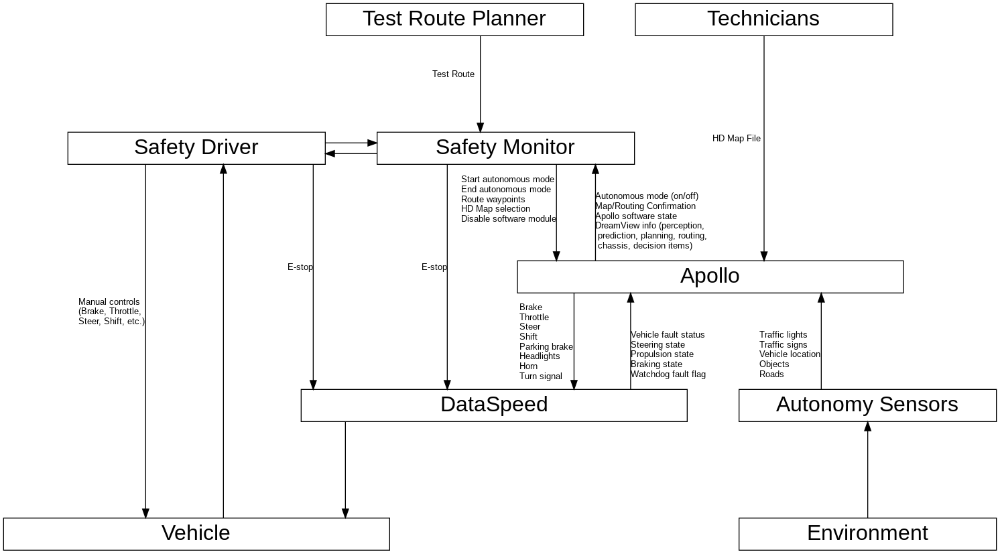

# Control Diagram

# Unsafe Control Actions (UCAs)

## Apollo

<table>
  <tr>
    <th>Control Action</th>
    <th>Not Providing</th>
    <th>Providing</th>
    <th>Too Early / Too Late / Out of Order</th>
    <th>Stopped Too Soon / Applied Too Long</th>
  </tr>

  <tr>
    <td>Brake Control  (brake control action with a significant level of braking: >x%)</td>
    <td class="Not Providing">
      UCA-6.1: Apollo does not provide brake control when relative velocity and distance to an obstacle mean that a collision is imminent  
      UCA-6.2: Apollo does not provide brake control when in autonomous mode and vehicle speed exceeds limits (limits for controllability, stability, upcoming manoeuvre, speed limit, traffic flow limit, planned test limit, etc.)  
      UCA-6.3: Apollo does not provide brake control when in autonomous mode, the vehicle is stationary, and vehicle path is not clear  
      UCA-6.4: Apollo does not provide brake control when in autonomous mode and the vehicle has reached the final destination  
      UCA-6.6: Apollo does not provide brake control when in autonomous mode and collision occurs
    </td>
    <td class="Providing">
      UCA-6.7: Apollo provides brake command with insufficient amount of braking below the minimum amount needed to avert a forward collision.  
      UCA-6.8: Apollo provides brake control when autonomous driving is not active (off, standby, overridden, or e-stop)  
      UCA-6.9: Apollo provides brake control when vehicle speed does not exceed limits (speed limit, traffic flow limit, manoeuvre limit, planned test limit, etc.), there is no obstacle, no faults, destination is reachable, and vehicle has not reached destination  
      UCA-6.10: Apollo provides brake control when driver is providing throttle  
      UCA-6.11: Apollo provides excessive brake command when wheel lock has occurred and lateral control is needed  (rationale: ABS may not work below 5mph or other situations)  
      UCA-6.12: Apollo provides brake command with insufficient amount of braking to reduce vehicle speed within limits (limits for controllability, stability, upcoming manoeuvre, speed limit, traffic flow limit, planned test limit, etc.)  
      UCA-6.13: Apollo provides brake control that is excessive beyond physical limits for passengers
    </td>
    <td class="Too Early / Too Late / Out of Order">
      UCA-6.14: Apollo provides brake control too late (> TBD seconds) after relative velocity and distance to an obstacle mean that a collision is imminent  
      UCA-6.15: Apollo provides brake control too late (> TBD seconds) prior to manoeuvre  
      UCA-6.16: Apollo provides brake control too late before (< TBD sec before) limits are exceeded (limits for upcoming manoeuvre, controllability, stability, speed limit, traffic flow limit, planned test limit, etc.)
    </td>
    <td class="Stopped Too Soon / Applied Too Long">
      UCA-6.17: Apollo removes brake control too early when relative velocity and distance to an obstacle mean that a collision will occur  
      UCA-6.18: Apollo removes brake control too early (> TBD seconds) prior to/during manoeuvre  
      UCA-6.19: Apollo stops applying brake control when in autonomous mode before (> TBD seconds before) vehicle slows to acceptable speed (speed limit, traffic flow limit, manoeuvre limit, planned test limit, limits for controllability, stability, etc.)  
      UCA-6.20: Apollo continues applying brake control too long (> TBD seconds) after vehicle slows to acceptable speed (speed limit, traffic flow limit, manoeuvre limit, planned test limit, limits for controllability, stability, etc.)  
      UCA-6.21: Apollo stops applying brake control too soon at end of test before driver has resumed control (e.g. manual braking)  
      UCA-6.22: Apollo stops applying brake control when collision occurs and driver has not resumed control (e.g. manual braking)
    </td>
  </tr>

  <tr>
    <td>Repetative Brake Command</td>
    <td class="Not Providing">
      UCA-7.1: Apollo does not provide any brake command (0-100%) when in autonomous mode (assumption: brake commands always sent on regular interval even if 0% brake is commanded)
    </td>
    <td class="Providing">

    </td>
    <td class="Too Early / Too Late / Out of Order">
      UCA-7.2: Apollo provides a brake command with too early timing that is outside of the time range when the signal is expected at the recipient (msg rate too high)  
      UCA-7.3: Apollo provides a brake command with too late timing that is outside of the time range specified for when the signal is supposed to arrive at the recipient (msg rate too low)
    </td>
    <td class="Stopped Too Soon / Applied Too Long">

    </td>
  </tr>

</table>

* Note : The difference between "brake control" and "brake command" is intentional. The brake command is sent repetitively by Apollo with a set time interval, even if the brake amount is 0 it is still sent. "Brake control" refers to a brake command with significant braking (>x%), which is functionally considered as "pressing the brakes".
